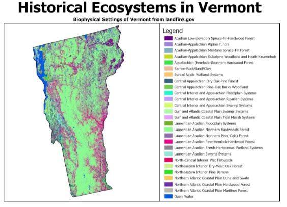

```{r setup, include=FALSE}
library(flexdashboard)
library(tidyverse)

library(RColorBrewer)
library(scales)
```

Historical Vegetation
=====================================  

Column {data-width=650}
-----------------------------------------------------------------------

### Chart A

```{r}

```

Column {data-width=350}
-----------------------------------------------------------------------

### Chart B

```{r}

# cove
nh_heat <- read_csv("nh_heat.csv", col_types = cols(percent = col_number()))


nhHeatChart <- ggplot(nh_heat,aes(x=evc, y=evh, fill = percent)) +
  geom_tile(color ='NA') +
  guides(fill=guide_legend(title="Percent of BpS \nper particular \ncombination")) +
  #scale_x_discrete(labels = function(x) paste0(x, "%")) +
  coord_cartesian(ylim=c(0, 22)) +
  labs(x="Canopy Cover",
       y="Canopy Height (meters)",
       title="Canopy cover and height combinations",
       subtitle = "Vermont Northern Hardwood") +
  scale_fill_distiller(palette = "BuGn", trans = "reverse") +
  theme_dark()
  #theme_bw(base_size=14)


nhHeatChart
```

### Chart C

```{r}

```

